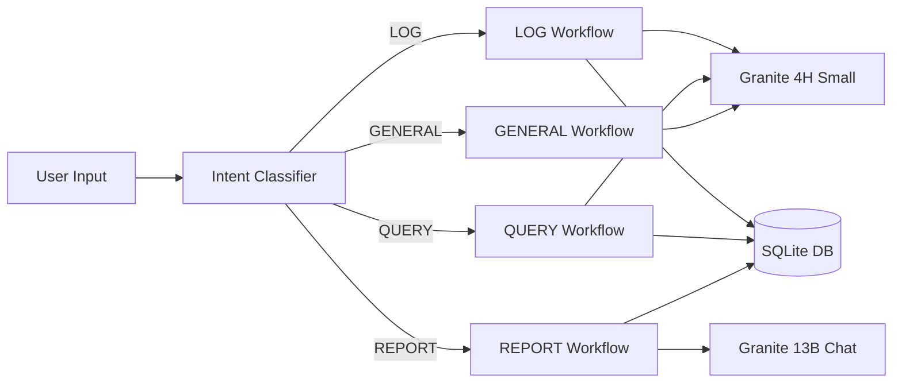

# AgriAgent 🌾

AI assistant for small-scale farmers. Built with Python, LangChain, IBM WatsonX, and Streamlit.

> Built during IBM WatsonX Hackathon (June 2025) • Refactored January 2026

## What it does

An intelligent farming assistant that routes natural language requests to specialized workflows:

- **LOG** - Record farm activities ("I sold 50 lbs of tomatoes for $75")
- **QUERY** - Ask questions about your data ("What are my total sales?")
- **REPORT** - Generate business summaries ("Give me a weekly sales report")
- **GENERAL** - Get farming advice ("When should I plant garlic?")

## Quick Start

### 1. Install Dependencies

```bash
pip install -r requirements.txt
```

### 2. Configure Credentials

Create a `.env` file in the project root (see `ENV_SETUP.txt` for details):

```env
WATSONX_URL=https://us-south.ml.cloud.ibm.com
PROJECT_ID=your_project_id
WATSONX_APIKEY=your_api_key
```

### 3. Verify Setup

```bash
python test_setup.py
```

You should see: `🎉 Setup complete! Ready to run.`

### 4. Seed Demo Data (Optional)

```bash
python seed_data.py
```

This creates test users with sample farm activities for immediate testing.

### 5. Run the App

**Streamlit Web UI (Recommended):**
```bash
streamlit run app.py
```

Then open http://localhost:8501

**CLI Mode:**
```bash
python main.py
```

**Deployed Version:**
Visit: https://agri-agent-ibm-watsonx.streamlit.app

---

## Usage Examples

**Login:** Use any email (e.g., `testuser@gmail.com` for seeded data)

**Try These Prompts:**

```
LOG workflow:
"I sold 50 lbs of tomatoes for $75"
"Harvested 100 pounds of potatoes from west field"
"Bought 5 bags of fertilizer for $120"

QUERY workflow:
"What are my total sales?"
"How much did I earn from tomatoes?"
"Show me all my logged activities"

REPORT workflow:
"Give me a weekly sales report"
"Generate a summary of all my expenses"
"Show me my profit and loss"

GENERAL workflow:
"When should I plant garlic?"
"How do I prevent potato blight?"
"What's a good crop rotation for tomatoes?"
```

See `EXAMPLES.md` for more detailed usage scenarios.

---

## Deployment

See `DEPLOYMENT.md` for production deployment instructions (Streamlit Cloud, Docker, etc.).

## Architecture

The system uses intent-based routing with per-user data isolation:

**Storage Layer:**
- SQLite databases per user (`data/{user}_data.db`)
- Per-user isolation for data privacy
- SQL-based aggregations for accurate calculations
- Schema validation and data integrity
- Efficient querying without full dataset loads

**LLM Configuration:**
- **Granite-4-H-Small** (512 tokens) - Fast responses for LOG/QUERY/GENERAL workflows
- **Granite-13B-Chat-V2** (2048 tokens) - Detailed outputs for REPORT workflow
- Pre-computed SQL statistics reduce calculation errors
- Optimized token budgets per workflow type

**Key Features:**
- Intent classification using LLM-based routing
- RAG (Retrieval-Augmented Generation) for data queries
- Robust JSON extraction with multi-strategy fallback
- Comprehensive error handling with contextual examples
- Demo data seeding for development/testing

---

## Project Structure

```
agri-agent/
├── app.py                    # Streamlit web interface
├── main.py                   # CLI interface + intent routing
├── langchain_config.py       # IBM WatsonX dual-model setup
├── routing_prompt.txt        # Intent classifier (enhanced V2)
├── db_storage.py            # SQLite storage layer
├── seed_data.py             # Demo data generation
├── test_setup.py            # Environment verification
└── workflows/               # 4 specialized workflows
    ├── log_flow.py          # Activity extraction & validation
    ├── query_flow.py        # RAG with SQL aggregations
    ├── report_flow.py       # Large model + comprehensive stats
    └── general_flow.py      # Farming knowledge base
```

## Tech Stack

**Core:**
- Python 3.11+
- LangChain 0.3.x (modern split-package architecture)
- IBM WatsonX (Granite-4-H-Small + Granite-13B-Chat-V2)
- Streamlit 1.36

**Data Layer:**
- SQLite - Structured storage with aggregations

**Patterns:**
- Intent-based routing with LLM classifier
- RAG (Retrieval-Augmented Generation) for data queries
- Per-user data isolation
- Dual-model optimization (speed vs. detail)

## How it Works



**Flow:**
1. User input → Intent classifier (LLM-based routing)
2. Route to specialized workflow (LOG/QUERY/REPORT/GENERAL)
3. Workflow processes with optimized model and prompt
4. Return formatted response

**Key Design Decisions:**
- **Per-user databases** - Privacy and data isolation
- **SQL pre-aggregation** - Accurate math without relying on LLM calculations
- **Dual models** - Speed for interactions, detail for reports
- **Robust parsing** - Multiple strategies for LLM JSON extraction

Built to demonstrate production-ready AI patterns with IBM WatsonX Granite models while working within enterprise cloud constraints.
